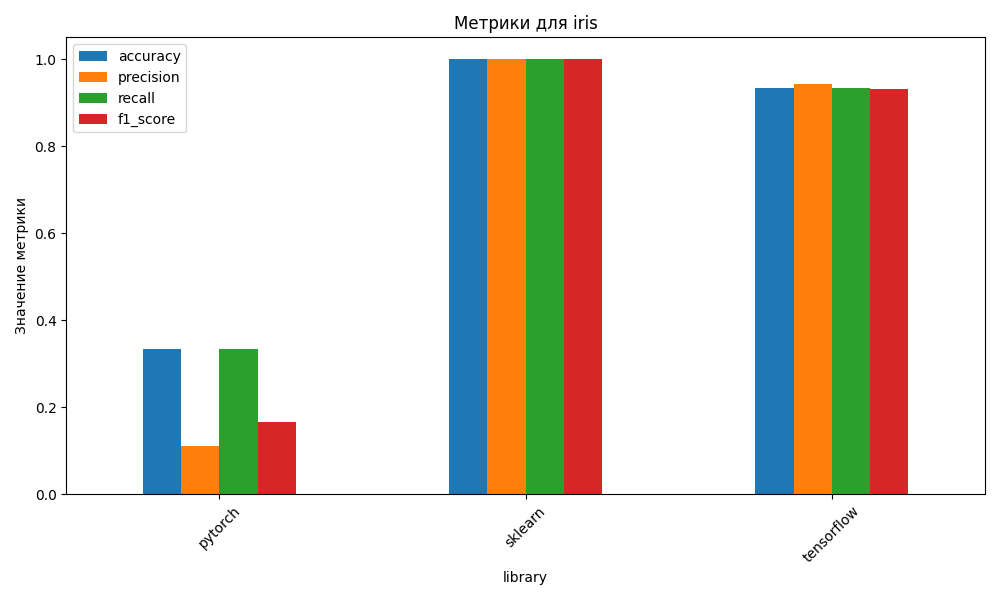

# Сравнение различных библиотек машинного обучения: Scikit-learn, TensorFlow и PyTorch

Данный проект представляет собой исследование производительности и особенностей библиотек машинного обучения Scikit-learn, 
TensorFlow и PyTorch на примере задач классификации и регрессии. Реализованы алгоритмы обработки данных, обучения моделей 
и анализа метрик для трёх реальных датасетов.

---

## Описание проекта

Проект направлен на сравнение трёх популярных библиотек машинного обучения с целью:
- Оценки их производительности на задачах бинарной классификации, многоклассовой классификации и регрессии.
- Выявления сильных и слабых сторон каждой библиотеки.
- Определения оптимальных сценариев использования.

Задачи проекта:
1. Бинарная классификация (Titanic): предсказание выживаемости пассажиров.
2. Многоклассовая классификация (Iris): классификация видов цветов.
3. Регрессия (House Prices): прогнозирование цен на жильё.

---

## Установка проекта

1. Клонируйте проект с GitHub:
   ```bash
   git clone https://github.com/AGMalkov/ThesisML.git
   ```

2. Перейдите в папку проекта:
   ```bash
   cd ThesisML
   ```

3. Создайте виртуальное окружение:
   ```bash
   python -m venv venv
   source venv/bin/activate  # Для macOS/Linux
   venv\Scripts\activate     # Для Windows
   ```

4. Установите зависимости:
   ```bash
   pip install -r requirements.txt
   ```

---

## Использование проекта

Запуск основного скрипта для одной из моделей:
```bash
python models/titanic_binary_classification/scikit_learn_main.py
```

## Демонстрация работы

### Результаты выполнения скрипта `scikit_learn_main.py`


Пример использования:
```python
from sklearn.linear_model import LogisticRegression
from sklearn.metrics import accuracy_score

# Создание и обучение модели
model = LogisticRegression()
model.fit(X_train, y_train)

# Предсказание и оценка
y_pred = model.predict(X_test)
accuracy = accuracy_score(y_test, y_pred)
print(f"Accuracy: {accuracy}")
```

---

## Основной функционал

### Классификация Titanic
- Используются библиотеки Scikit-learn, TensorFlow и PyTorch.
- Оценка метрик: Accuracy, Precision, Recall, F1-Score.
- Визуализация: график сравнения метрик для всех библиотек (Titanic).


### Классификация Iris
- Реализация многоклассовой классификации с использованием логистической регрессии и нейронных сетей.
- Применение функции потерь CrossEntropyLoss (PyTorch) и CategoricalCrossentropy (TensorFlow).
- Визуализация: график сравнения метрик для Iris.



### Регрессия House Prices
- Прогнозирование цен на жильё.
- Метрики: Mean Squared Error, Mean Absolute Error, R² Score.
- Визуализация: график сравнения метрик для House Prices.


### Дополнительный функционал
- Генерация сводной таблицы с метриками: `results_summary.csv`.
- Анализ производительности библиотек по времени обучения.
- Сравнение гибкости библиотек на основе реализованных моделей.

### Пример файла `results_summary.csv`


---

## Telegram-бот для демонстрации

В рамках проекта реализован Telegram-бот, который позволяет пользователям взаимодействовать с результатами исследований в удобном формате. Бот предоставляет следующие возможности:
- Получение сводной таблицы метрик для каждой библиотеки.
- Просмотр графиков сравнения метрик для различных задач (Titanic, Iris, House Prices).
- Получение пошаговой инструкции по запуску скриптов проекта.

### Установка и запуск бота
1. Клонируйте репозиторий и перейдите в папку проекта:
   ```bash
   git clone https://github.com/AGMalkov/ThesisML.git
   cd ThesisML
   ```

2. Создайте виртуальное окружение и установите зависимости:
   ```bash
   python -m venv venv
   source venv/bin/activate  # Для macOS/Linux
   venv\Scriptsctivate     # Для Windows
   pip install -r requirements.txt
   ```

3. Настройте переменные окружения:
   - Создайте файл `.env` в корне проекта.
   - Укажите API-токен вашего Telegram-бота:
     ```
     TELEGRAM_BOT_TOKEN=<ваш_токен>
     ```

4. Запустите бота:
   ```bash
   python telegram_bot.py
   ```

### Использование бота
1. Найдите бота в Telegram и начните диалог.
2. Используйте доступные команды.

---

## Запуск Telegram-бота

Для запуска Telegram-бота выполните следующие действия:

1. Убедитесь, что вы настроили переменные окружения, как указано в разделе "Установка и запуск бота".
2. Запустите бота:
   ```bash
   python telegram_bot.py
   ```

После запуска бот будет доступен для взаимодействия через Telegram.

---

## Структура проекта

```
ThesisML/
├── .venv/                     # Виртуальное окружение
├── data/                      # Данные для экспериментов
│   ├── house_prices.csv       # Датасет для задачи регрессии
│   ├── iris.csv               # Датасет для многоклассовой классификации
│   └── titanic.csv            # Датасет для бинарной классификации
├── models/                    # Реализация моделей для каждой задачи
│   ├── house_price_regression/      # Модели для задачи регрессии
│   ├── iris_multiclass_classification/ # Модели для задачи многоклассовой классификации
│   └── titanic_binary_classification/  # Модели для задачи бинарной классификации
├── results/                   # Результаты экспериментов
│   ├── house_metrics_comparison.png  # График сравнения для задачи регрессии
│   ├── house_price_pytorch_metrics.json # Метрики для модели PyTorch
│   ├── house_price_sklearn_metrics.json # Метрики для модели Scikit-learn
│   ├── house_price_tensorflow_metrics.json # Метрики для модели TensorFlow
│   ├── iris_metrics_comparison.png       # График сравнения для многоклассовой классификации
│   ├── iris_pytorch_metrics.json         # Метрики для модели PyTorch
│   ├── iris_sklearn_metrics.json         # Метрики для модели Scikit-learn
│   ├── iris_tensorflow_metrics.json      # Метрики для модели TensorFlow
│   ├── titanic_metrics_comparison.png    # График сравнения для бинарной классификации
│   ├── titanic_pytorch_metrics.json      # Метрики для модели PyTorch
│   ├── titanic_sklearn_metrics.json      # Метрики для модели Scikit-learn
│   └── titanic_tensorflow_metrics.json   # Метрики для модели TensorFlow
├── screenshots/               # Скриншоты для документации
│   ├── scikit_learn_main.png  # Скриншот работы Scikit-learn
│   ├── results_summary.png    # Пример сводной таблицы с метриками
├── analyze_results.py         # Скрипт для анализа результатов и построения графиков
├── README.md                  # Документация проекта
├── requirements.txt           # Зависимости проекта
├── results_summary.csv        # Сводная таблица с метриками
└── results_summary.py         # Скрипт для анализа и генерации таблицы метрик
└── telegram_bot.py            # Реализация Телеграмм бота
```

---

## Автор проекта

*Антон Малков*  


